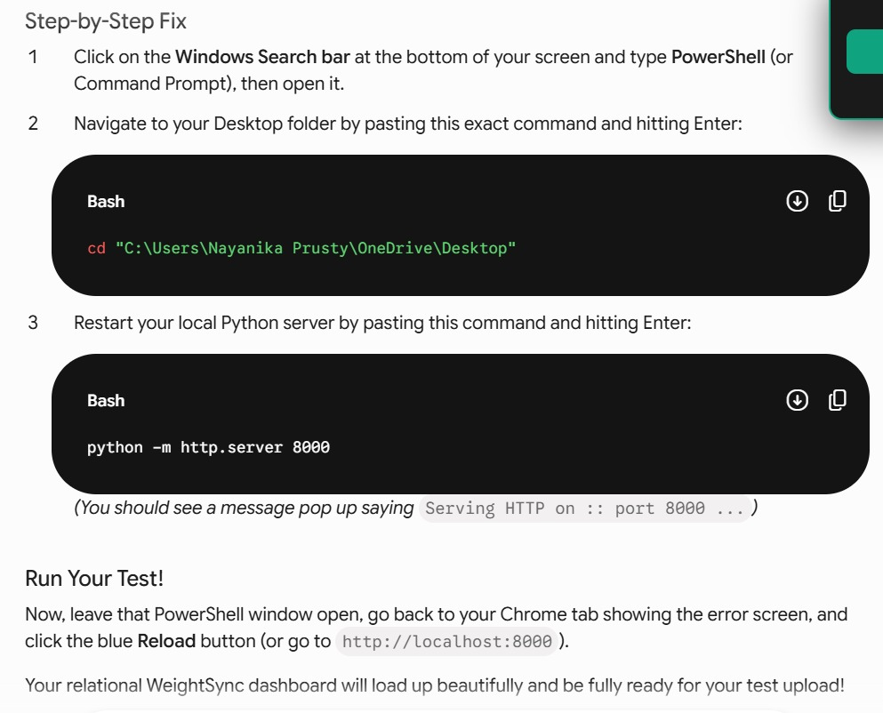

# WeightSync: Relational Cloud Data Pipeline & Asset Management Dashboard

🔗 **[Launch Live Application](https://nayanikaprusty518-hue.github.io/WeightSync/)**

WeightSync is a full-stack data logging platform engineered for specialized asset tracking and inventory ecosystems (e.g., waste management, logistics tracking). The architecture explicitly decouples heavy unstructured media files from lightweight transactional metadata, optimizing query execution speed and database normalization patterns.

---

## 🚀 Architectural Blueprint

Rather than utilizing a flat, single-table database model that forces text redundancy, WeightSync enforces a **normalized 1-to-1 relational database schema** backed by enterprise cloud infrastructure.

* **Decoupled Cloud Storage:** Heavy binary image assets are asynchronously streamed directly to an S3-compatible cloud object storage bucket, keeping database sizes highly optimized.
* **Enforced Operational Compliance:** A strict unique constraint is applied to the foreign key layer, structurally guaranteeing that **one tracked asset image maps to exactly one weight entry**—preventing data history duplication or metric corruption.
* **Automated Lifecycle Management:** Built-in `ON DELETE CASCADE` backend triggers ensure that deleting a parent asset row automatically wipes the linked child metrics and purges the object storage bucket simultaneously, eliminating orphaned data and cloud storage clutter.

---

## 📸 System Walkthrough & UI

### Live Relational Dashboard


### Core Operations Pipeline
> 🎥 **Walkthrough Video:** Navigate to the project's assets directory to screen the real-time operational capture (`demo_walkthrough.mp4`) tracking multi-stage asynchronous cloud uploads, relational key alignment, and cascading deletion sequences.

---

## 🛠️ Technology Stack & Infrastructure

* **Frontend Client Layer:** HTML5, Asynchronous ES6 JavaScript (Fetch API / Promises), Tailwind CSS
* **Cloud Infrastructure Engine:** Supabase Platform (PostgreSQL Relational Engine)
* **Object Architecture:** Supabase Storage (Secure Media Buckets)

---

## 🗄️ Relational Database Schema Design

### 1. `items` Table (Parent Asset Layer)
Tracks the core asset instance and its remote binary location.
| Column Name | Data Type | Key Constraints | Description |
| :--- | :--- | :--- | :--- |
| `id` | `int8` | Primary Key (Identity) | Unique internal sequence key for the physical asset |
| `created_at` | `timestamptz` | Default (`now()`) | Precise transactional timestamp |
| `image_url` | `text` | - | Public cloud endpoint routing to the stored asset photo |

### 2. `weight_logs` Table (Child Metric Layer)
Tracks transactional weight calculations bound to specific parent assets.
| Column Name | Data Type | Key Constraints | Description |
| :--- | :--- | :--- | :--- |
| `id` | `int8` | Primary Key (Identity) | Unique internal sequence identifier for the metric log |
| `weight` | `float8` | - | Logged numeric calculation metric (e.g., kilograms/tonnage) |
| `item_id` | `int8` | Foreign Key (`items.id`) / **UNIQUE** | Structural mapping column enforcing the 1-to-1 integrity rule |

> 🔒 **Data Integrity Guardrail:** The `item_id` column utilizes an explicit `UNIQUE` index constraint alongside an `ON DELETE CASCADE` operational directive to ensure pristine referential integrity.

---

## 💻 Local Implementation & Execution

To spin up a local instance of the client application layer smoothly without encountering cross-origin (CORS) security boundaries:

1. Clone the repository to your local directory setup:
   ```bash
   git clone [https://github.com/nayanikaprusty518-hue/WeightSync.git](https://github.com/nayanikaprusty518-hue/WeightSync.git)
   cd WeightSync
   
2. Launch a local development server instance using your Python environment:
   ```bash
   python -m http.server 8000

3. Open your browser and navigate directly to the application UI:
   ```bash
   http://localhost:8000
